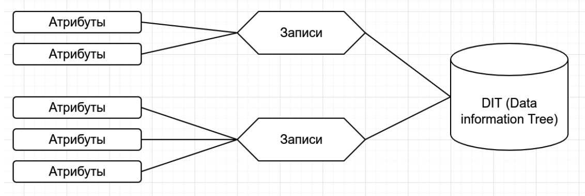
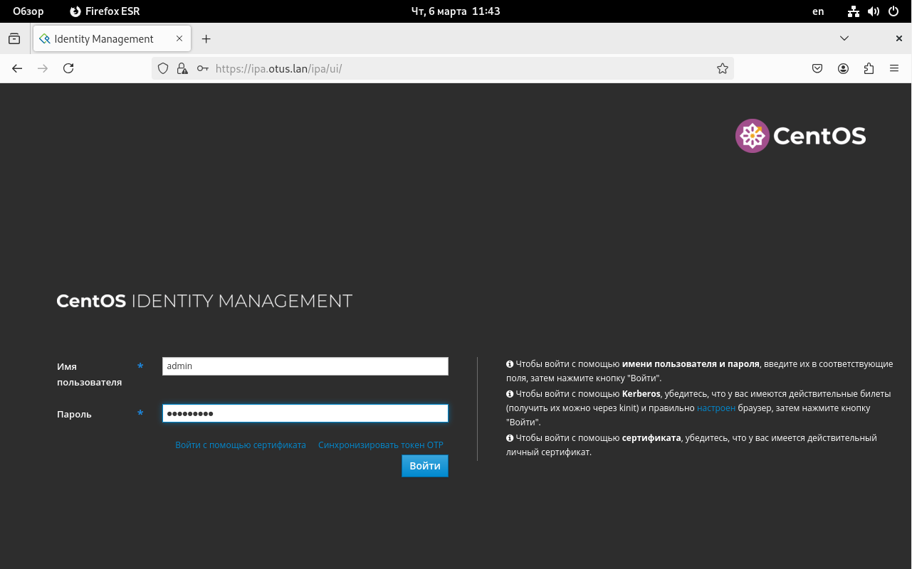
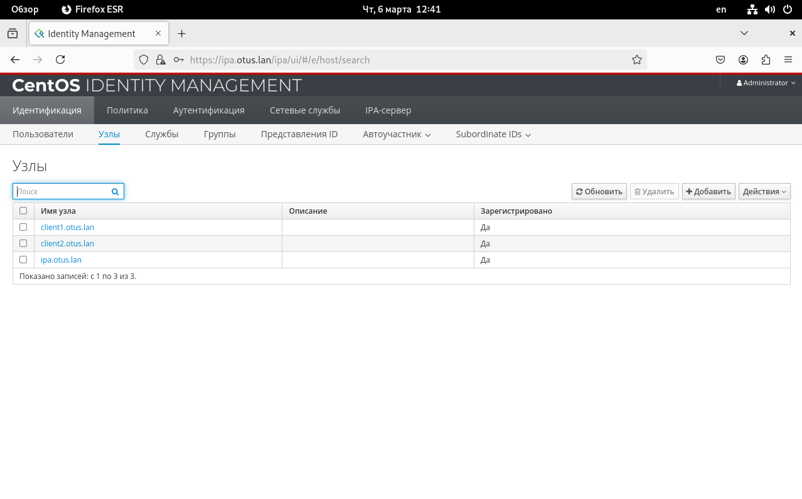
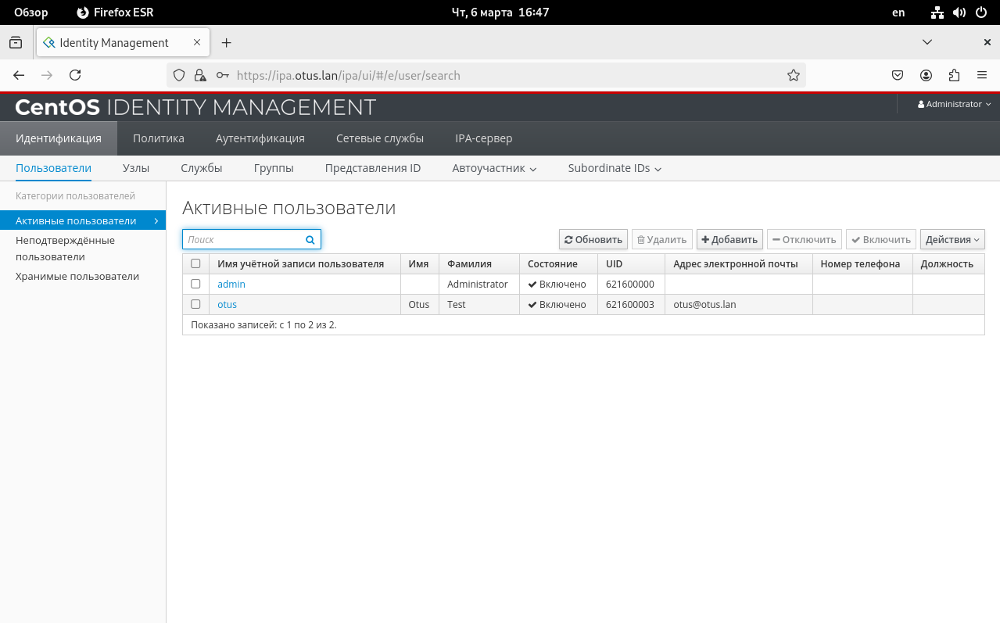
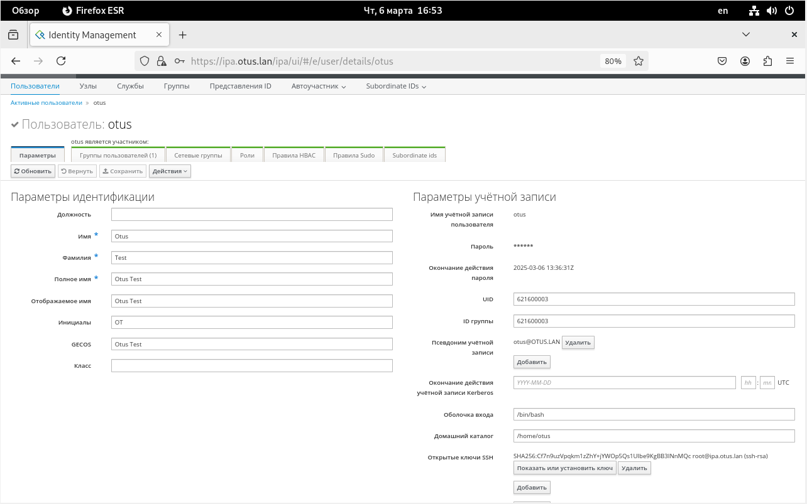

# Vagrant-стенд c LDAP на базе FreeIPA


### Цель задания
Научиться настраивать LDAP-сервер и подключать к нему LDAP-клиентов

### Описание домашнего задания
  
1) Установить FreeIPA  
2) Написать Ansible-playbook для конфигурации клиента  
  
Дополнительное задание  
3) * Настроить аутентификацию по SSH-ключам  
4) ** Firewall должен быть включен на сервере и на клиенте  

### Введение
LDAP (Lightweight Directory Access Protocol — легковесный протокол доступа к каталогам) —  это протокол для хранения и получения данных из каталога с иерархической структурой.
LDAP не является протоколом аутентификации или авторизации 

С увеличением числа серверов затрудняется управление пользователями на этих сервере. LDAP решает задачу централизованного управления доступом. 
С помощью LDAP можно синхронизировать:
- UID пользователей
- Группы (GID)
- Домашние каталоги
- Общие настройки для хостов 
- И т. д. 

LDAP работает на следующих портах: 
- 389/TCP — без TLS/SSL
- 636/TCP — с TLS/SSL

Основные компоненты LDAP  


Атрибуты — пара «ключ-значение». Пример атрибута: mail: admin@example.com
Записи (entry) — набор атрибутов под именем, используемый для описания чего-либо

Пример записи:
dn: sn=Ivanov, ou=people, dc=digitalocean,dc=com
objectclass: person
sn: Ivanov
cn: Ivan Ivanov

Data Information Tree (DIT) — организационная структура, где каждая запись имеет ровно одну родительскую запись и под ней может находиться любое количество дочерних записей. Запись верхнего уровня — исключение
На основе LDAP построенно много решений, например: Microsoft Active Directory, OpenLDAP, FreeIPA и т. д.

В данной лабораторной работе будет рассмотрена установка и настройка FreeIPA. FreeIPA — это готовое решение, включающее в себе:
Сервер LDAP на базе Novell 389 DS c предустановленными схемами
Сервер Kerberos
Предустановленный BIND с хранилищем зон в LDAP
Web-консоль управления
  
## Выполнение    
### 1.  С помощью vagrant развернул тестовый стенд из трех виртуальных машин:    
|Имя|IP-адрес|
|-|-|
|ipa.otus.lan|192.168.57.10|
|client1.otus.lan|192.168.57.11|
|client2.otus.lan|192.168.57.12|    

### 2. Создал ansible playbook и роли    
Запустил playbook    
```shell
root@ansible:/home/vagrant/ansible# ansible-playbook ldap.yml

PLAY [Configure FreeIPA Server] *******************************************************************************

TASK [Gathering Facts] ****************************************************************************************
ok: [ipa.otus.lan]
...
PLAY RECAP ****************************************************************************************************
client1.otus.lan           : ok=12   changed=1    unreachable=0    failed=0    skipped=0    rescued=0    ignored=0
client2.otus.lan           : ok=12   changed=1    unreachable=0    failed=0    skipped=0    rescued=0    ignored=0
ipa.otus.lan               : ok=18   changed=4    unreachable=0    failed=0    skipped=3    rescued=0    ignored=0
```   
Playbook отработал без ошибок    

### 2.3. Далее перешел в браузер и открыл веб панель сервера

*Перед тем как пробовать открыть web ui панель через браузер, в файл hosts на хостовой машине внес запись:*    
*192.168.57.10 ipa.otus.lan ipa, иначе web ui не отобразится в браузере даже при верно настроенном ipa сервере*   

    

Ввел пароль от пользователя admin и попал в рабочую веб-консоль управления FreeIPA. Данные во FreeIPA можно вносить как через веб-консоль, так и средствами командной строки.    
    
В веб-консоли перехожу к вкладке узлы, вижу что сервера добавлены    

     


### 3. Настройка аутентификации пользователя по SSH-ключам    
Добавление SSH-ключа в FreeIPA для пользователя    
На сервере ipa сгенерировал SSH-ключ пользователя командой ssh-keygen    
```shell
[root@ipa ~]# ssh-keygen
Generating public/private rsa key pair.
Enter file in which to save the key (/root/.ssh/id_rsa): ipa
Enter passphrase (empty for no passphrase):
Enter same passphrase again:
Your identification has been saved in ipa
Your public key has been saved in ipa.pub
The key fingerprint is:
SHA256:S8G7HuIuD3HArgjMn8W6YmNlwehDU3hXMZMslHluDMA root@ipa.otus.lan
The key's randomart image is:
+---[RSA 3072]----+
|  o.o.==o        |
| . E * =o        |
|  = + * o        |
|o+ +.. + o       |
|+o. +oo S        |
|.+.++o . o       |
|. =+. . +        |
| =  oo o .       |
|o o. ++ .        |
+----[SHA256]-----+  
```
Т.к. скрипт ansible уже включает добавление пользователя, на вкладке пользователи, кликаю на пользователя Otus. Проваливаюсь в аккаунт пользователя, вижу что ssh ключ присутствует    



    


### 4. Настройка файерволла    

Для работы LDAP необходимо открыть следующие порты    

|Номер порта|Протокол|Название службы|
|-|-|-|
|53|tcp/udp|DNS|
|80, 443|tcp|HTTP/HTTPS|
|389, 636|tcp|LDAP/LDPAS|
|88, 464|tcp/udp|Kerberos|
|123|tcp/udp|NTP|     

Playbook ansible в моем скрипте уже включает задачу включения firewalld и открытия нужных портов, просто убедился что все так и есть    

```shell
[root@ipa ~]# firewall-cmd --list-all
public (active)
  target: default
  icmp-block-inversion: no
  interfaces: eth0 eth1
  sources:
  services: cockpit dhcpv6-client freeipa-ldap ssh
  ports: 80/tcp 443/tcp 389/tcp 636/tcp 88/tcp 88/udp 464/tcp 464/udp 53/tcp 53/udp 123/udp
  protocols:
  forward: yes
  masquerade: no
  forward-ports:
  source-ports:
  icmp-blocks:
  rich rules:
```    
____________________________________________________________________     
end


